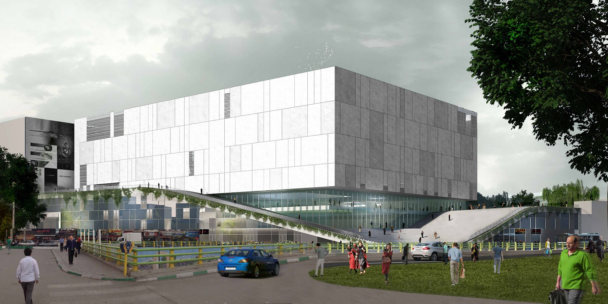
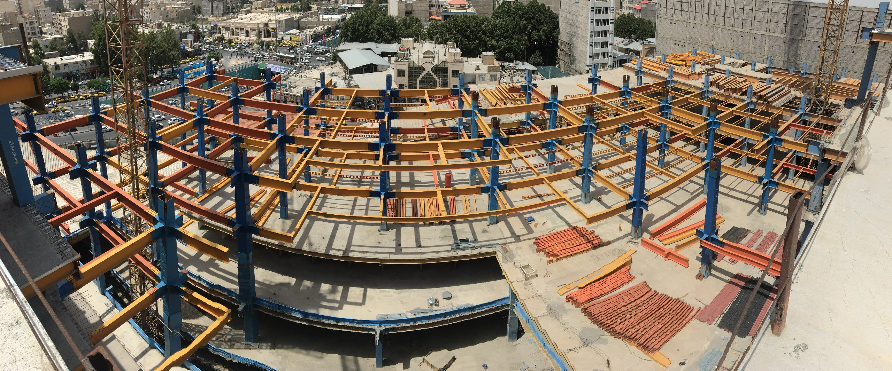

# 🏢 Shahriar Mall – Website Rebuild

This repository documents the **complete redesign and redevelopment** of the official website for **Shahriar Mall**, a new shopping center located in **Shahriar, Tehran, Iran**.

---

## 🌐 Current Website

The existing site is live at:  
🔗 [https://shahriarmall.com](https://shahriarmall.com)

It is currently built with **WordPress** and serves as a temporary solution during the mall’s construction.

---

## 🚀 Project Goal

This repo is for a **new version** of the website — built from scratch using modern web technologies for better speed, design, flexibility, and long-term scalability.

This includes:
- Clean design and responsive layout
- Faster performance
- Easier maintainability
- Better SEO and structure
- Potential backend features for mall tenants or visitors

---

## 📌 Project Status

- 🏗️ **Mall Construction:** ~40% complete
- 🧱 **Website Redevelopment:** Planning and design phase
- 🔁 WordPress site remains active during development

---

## 🖼️ Mall Construction Photos

  

  

---

## 🛠️ Tech Stack (Planned)

| Layer        | Tools (planned)                           |
|--------------|--------------------------------------------|
| **Frontend** | HTML, Tailwind CSS, TypeScript, maybe React |
| **Backend**  | Node.js or static build (TBD)              |
| **Hosting**  | Iran Server    |
| **Versioning** | Git + GitHub (public repo)               |

---

## 📁 Folder Structure (WIP)
shahriar-mall/
├── README.md
├── assets/ # Images, logos, icons
├── frontend/ # Source files (HTML, CSS, TS)
├── design/ # Sketches, drafts, wireframes
├── notes/ # Hosting info, decisions, TODOs

---

## 📆 Dev Progress Log

- **Day 1** — Repo created, images added, planning started
- **Day 2** — README and project goal defined  
*(update this daily to keep track)*

---

## 📄 License

For educational and showcase use.  
If/when the site goes live in production, a formal license will be added.

---

## 🙌 Author

**@rezPirayesh**  
Rebuilding Shahriar Mall's digital presence — one commit at a time 🧱💻

